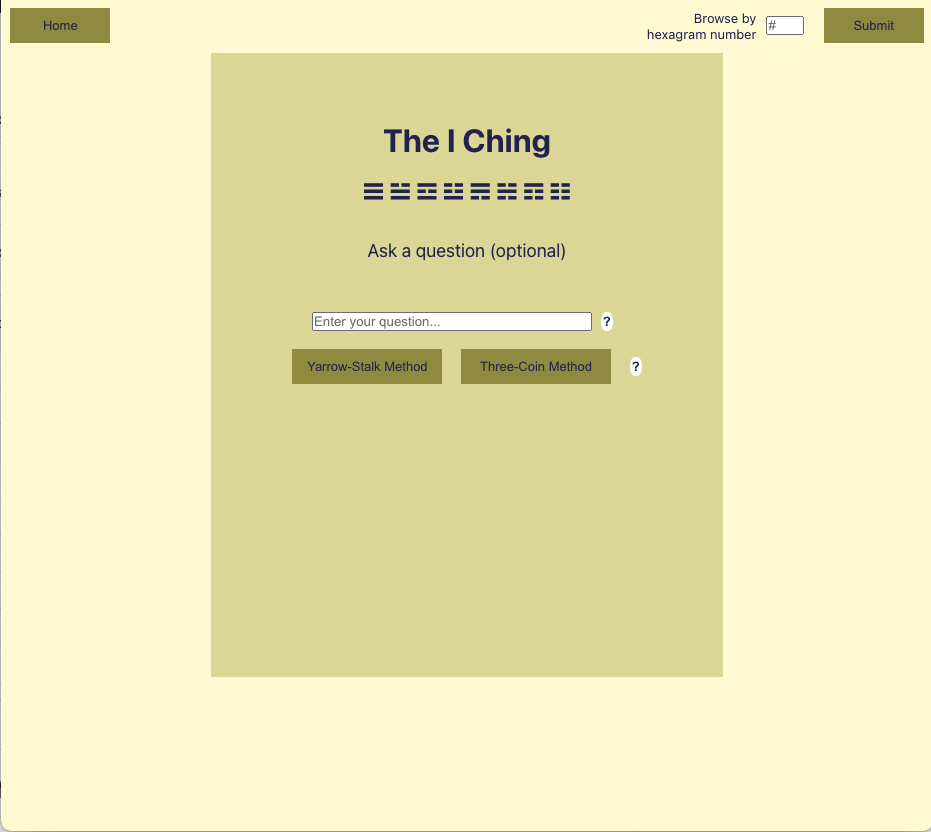

<br />
<p align="center">
    
  </a>

  <h3 align="center">The I Ching</h3>
  <a href="theiching.net">theiching.net</a>

  <p align="center">
    A program for consulting the I Ching.
  </p>
</p>

## Contributors

Joseph Kranak  [![LinkedIn][linkedin-shield]][linkedin-url]


## About The Project




This is a very light application. All data needed is stored in four JSON files in the data folder, including three separate translations. I used translations by [James Legge](https://sacred-texts.com/ich/), [Richard Wilhelm](http://www.pantherwebworks.com/i_ching/index.html) and [Gregory C. Richter](http://grichter.sites.truman.edu/files/2012/01/yjnew.pdf). There are many other translations, but I chose these because they are in the public domain and are each quite different from each other.

The page has the option of consulting the I Ching using the yarrow-stalk or three-coin methods. The yarrow-stalk method is the traditional method, whereas the coin method is more popular (because it's simpler). For the purpose of this website, the difference between them is simply in the odds of certain types of changing lines. More information about the methods can be found [here](https://en.wikipedia.org/wiki/I_Ching_divination#Yarrow_stalks) and [here](https://www.instructables.com/Consult-the-I-Ching-with-Yarrow-Stalks/), and you can check this project's [explainer](./iching/src/pages/Explanation.js) on the methods, which I wrote.

### Built With

* [React](https://getbootstrap.com)
* [Sass](https://jquery.com)
* [Typescript](https://www.typescriptlang.org/)
* [React Router Dom](https://www.npmjs.com/package/react-router-dom)


<!-- GETTING STARTED -->
## Getting Started
To get a local copy up and running follow these simple example steps.

### Prerequisites
* npm
  ```sh
  npm install npm@latest -g
  ```

### Installation

1. Clone the repo
   ```sh
   git clone https://github.com/your_username_/Project-Name.git
   ```
2. Install NPM packages
   ```sh
   iching-pwa/iching % npm install
   ```
3. Run React development server
   ```sh
   iching-pwa/iching % npm start
   ```

## License

Distributed under the MIT License. See `LICENSE` for more information.

## Contact

Joseph Kranak: [https://www.linkedin.com/in/joseph-kranak/](https://www.linkedin.com/in/joseph-kranak/)

Project Link: [https://github.com/jkranak/iching-pwa](https://github.com/jkranak/iching-pwa)


[linkedin-shield]: https://img.shields.io/badge/-LinkedIn-black.svg?style=for-the-badge&logo=linkedin&colorB=555
[linkedin-url]: https://www.linkedin.com/in/joseph-kranak/
