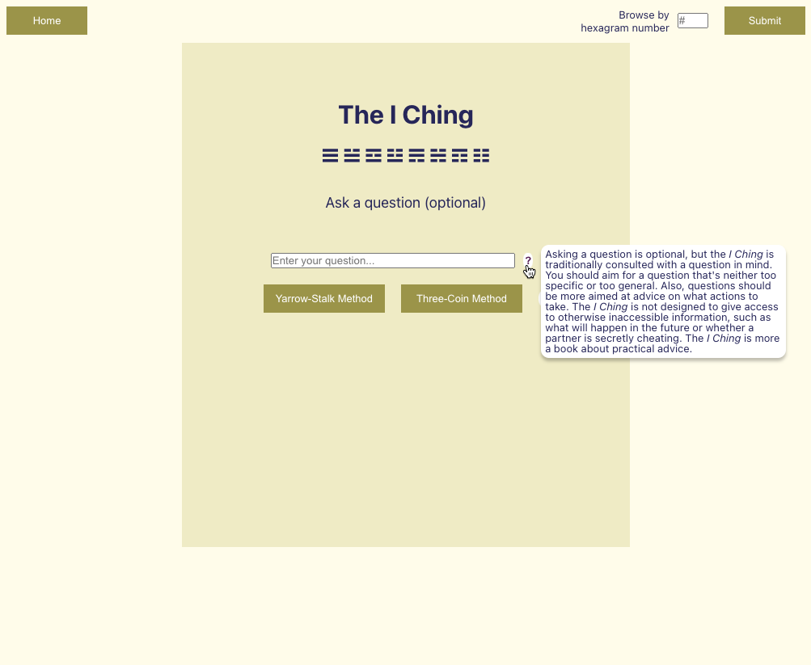

<br />
<p align="center">
    
  </a>

  <h3 align="center">The I Ching</h3>

  <p align="center">
    A program for consulting the I Ching.
  </p>
</p>

## Contributors

Joseph Kranak  [![LinkedIn][linkedin-shield]][linkedin-url]


## About The Project




### Built With

* [React](https://getbootstrap.com)
* [Sass](https://jquery.com)
* [React Router Dom](https://www.npmjs.com/package/react-router-dom)


<!-- GETTING STARTED -->
## Getting Started
To get a local copy up and running follow these simple example steps.

### Prerequisites
* npm
  ```sh
  npm install npm@latest -g
  ```

### Installation

1. Clone the repo
   ```sh
   git clone https://github.com/your_username_/Project-Name.git
   ```
2. Install NPM packages
   ```sh
   iching-pwa/iching % npm install
   ```
3. Run React development server
   ```sh
   iching-pwa/iching % npm start
   ```

## License

Distributed under the MIT License. See `LICENSE` for more information.

## Contact

Joseph Kranak: [https://www.linkedin.com/in/joseph-kranak/](https://www.linkedin.com/in/joseph-kranak/)

Project Link: [https://github.com/jkranak/iching-pwa](https://github.com/jkranak/iching-pwa)


[linkedin-shield]: https://img.shields.io/badge/-LinkedIn-black.svg?style=for-the-badge&logo=linkedin&colorB=555
[linkedin-url]: https://www.linkedin.com/in/joseph-kranak/
